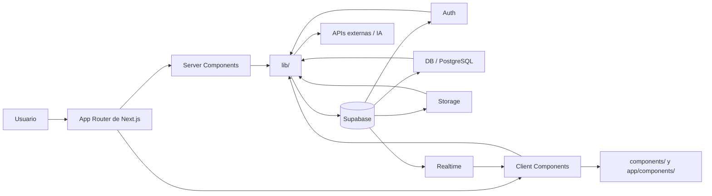

# Portafolio Técnico - Monte Sion App

Este documento resume el material que conviene incluir en una entrega de portafolio para Monte Sion App. La meta es mostrar producto, arquitectura, seguridad, validación y madurez técnica de forma clara y verificable.

## 1. Evidencia visual

Para el detalle operativo de capturas y mini demos, usa [SCREENSHOTS.md](SCREENSHOTS.md). Aquí queda el mapa general de lo que debe verse.

- Landing pública.
- Inicio de sesión.
- Panel administrativo.
- Chat.
- Peticiones de oración.
- Vista móvil.
- Diagrama de arquitectura.

### Recomendación de presentación

- Capturas en resolución de escritorio y móvil.
- Un video o GIF corto por flujo principal.
- Nombres consistentes para los assets, por ejemplo `landing-home.png`, `login-success.gif`, `admin-dashboard.png`.
- Texto breve debajo de cada imagen con contexto y resultado.

## 2. Arquitectura



### Rol de cada módulo

- `app/`: rutas, layouts, páginas y composición de la experiencia.
- `components/` y `app/components/`: UI reutilizable y piezas de dominio.
- `lib/`: server actions, acceso a datos, validación, utilidades y reglas de negocio.
- `hooks/`: lógica de estado y formularios reutilizable.
- `supabase/`: migraciones, seeds y scripts SQL.
- Supabase Auth: autenticación y sesión.
- Supabase DB: persistencia de usuarios, peticiones, avisos, chat y demás datos.
- Supabase Storage: archivos o recursos persistidos si aplica.
- Supabase Realtime: actualizaciones en vivo, especialmente útiles para chat o estados dinámicos.

### Flujo de datos recomendado

- Lectura: interfaz -> helper o fetcher -> Supabase -> datos tipados -> render.
- Escritura: formulario -> validación -> server action -> verificación de sesión/rol -> Supabase -> respuesta consistente.
- Tiempo real: Supabase Realtime -> suscripción -> estado del cliente -> actualización visual.

## 3. Pruebas mínimas

El repositorio no trae Jest configurado hoy, pero sí vale la pena dejar definidos los casos mínimos para cubrir los flujos críticos.

### Prioridad alta

- Login exitoso e inválido.
- Validación de formulario de petición de oración.
- Renderizado básico del login y del panel admin.
- Guardas de acceso para rutas protegidas.
- Estados de error en formularios y server actions.

### Recomendación de stack

- Unit e integración: Jest + React Testing Library.
- Mocking de API/server actions: `jest.mock`.
- Si luego quieres E2E, añadir Playwright.

### Ejemplo 1: server action de login

```ts
import { loginAction } from "@/lib/auth-actions"
import { getSupabaseServer } from "@/lib/supabase-server"
import { redirect } from "next/navigation"

jest.mock("@/lib/supabase-server", () => ({
	getSupabaseServer: jest.fn(),
}))

jest.mock("next/navigation", () => ({
	redirect: jest.fn(),
}))

describe("loginAction", () => {
	it("devuelve error cuando las credenciales son inválidas", async () => {
		const signInWithPassword = jest.fn().mockResolvedValue({
			data: { user: null },
			error: { message: "Invalid login" },
		})

		;(getSupabaseServer as jest.Mock).mockResolvedValue({
			auth: { signInWithPassword },
		})

		const result = await loginAction({
			email: "demo@correo.com",
			password: "incorrecta",
		})

		expect(result).toEqual({ error: "Credenciales inválidas" })
		expect(redirect).not.toHaveBeenCalled()
	})
})
```

### Ejemplo 2: formulario de login

```tsx
import { render, screen } from "@testing-library/react"
import userEvent from "@testing-library/user-event"
import LoginForm from "@/app/components/login"

describe("LoginForm", () => {
	it("muestra los campos principales", () => {
		render(<LoginForm />)

		expect(screen.getByLabelText(/correo/i)).toBeInTheDocument()
		expect(screen.getByLabelText(/contraseña/i)).toBeInTheDocument()
		expect(screen.getByRole("button", { name: /iniciar sesión/i })).toBeInTheDocument()
	})

	it("permite escribir email y contraseña", async () => {
		const user = userEvent.setup()
		render(<LoginForm />)

		await user.type(screen.getByLabelText(/correo/i), "demo@correo.com")
		await user.type(screen.getByLabelText(/contraseña/i), "12345678")

		expect(screen.getByLabelText(/correo/i)).toHaveValue("demo@correo.com")
	})
})
```

### Ejemplo 3: validación de petición de oración

```tsx
import { render, screen } from "@testing-library/react"
import userEvent from "@testing-library/user-event"
import Form from "@/app/components/form"

describe("Prayer request form", () => {
	it("marca errores cuando faltan campos obligatorios", async () => {
		const user = userEvent.setup()
		render(<Form />)

		await user.click(screen.getByRole("button", { name: /enviar/i }))

		expect(screen.getByText(/obligatorio/i)).toBeInTheDocument()
	})
})
```

## 4. Refactor de código

La exploración del repo muestra zonas claras para endurecer tipado y limpiar código legado.

### Tipado fuerte sugerido

- [app/admin/AdminPeticiones.tsx](app/admin/AdminPeticiones.tsx): tipar la entidad de petición con un modelo explícito en lugar de usar estructuras débiles para filtros y resultados.
- [app/admin/AdminUsersTable.tsx](app/admin/AdminUsersTable.tsx): definir un tipo de usuario de administración con rol, email y estados derivados.
- [app/admin/AdminPageClient.tsx](app/admin/AdminPageClient.tsx): reemplazar configuraciones de gráficos o métricas sin tipo por interfaces concretas.
- [app/hooks/usePushNotifications.ts](app/hooks/usePushNotifications.ts): usar tipos DOM nativos como `PushSubscription` y tipos de error más precisos.

### Limpieza de código comentado o legado

- [app/components/card.tsx](app/components/card.tsx): quitar comentarios de migración y ejemplos de uso si ya no aportan valor al componente.
- [app/peticion/v2/page.tsx](app/peticion/v2/page.tsx): revisar comentarios de lógica vieja y mover la nota útil a documentación si todavía aplica.
- [app/enlaces/page.tsx](app/enlaces/page.tsx): retirar bloques comentados que ya no forman parte de la UI activa.
- [app/versiculos/page.tsx](app/versiculos/page.tsx): eliminar código comentado de flujos anteriores para reducir ruido.
- [proxy.ts](proxy.ts): revisar si el alias de `/home` y los comentarios de compatibilidad siguen siendo necesarios; si no, simplificar el middleware/proxy.

### Modularización

- Separar modelos compartidos en `lib/types/` o `types/` cuando el mismo dato se usa en admin, formularios y reportes.
- Mover helpers de filtros y transformación de tablas a funciones puras reutilizables.
- Mantener server actions por dominio, no mezclar acceso a Supabase con lógica de UI.
- Si una vista supera demasiada complejidad, dividirla en componentes de presentación y contenedores.

## 5. Resumen de rol

Texto breve listo para incluir en el portafolio:

- Diseñé la arquitectura de la aplicación con Next.js App Router, separación de responsabilidades y estructura modular por dominio.
- Implementé seguridad con autenticación, control de acceso por rol, validación de datos y uso seguro de Supabase en servidor.
- Organicé la modularización de componentes, hooks y acciones para mantener la base escalable y mantenible.
- Validé flujos críticos con formularios tipados, reglas de negocio y manejo consistente de errores.
- Preparé documentación técnica, evidencia visual y lineamientos de despliegue para presentación profesional.

## 6. Mensaje de portafolio sugerido

"Desarrollé Monte Sion App con Next.js, React, TypeScript y Supabase. Construí autenticación, panel administrativo, chat, peticiones de oración y formularios validados, con una arquitectura modular, foco en seguridad y documentación lista para portafolio y despliegue."

## 7. Checklist final

- [ ] `npm run lint` pasa sin errores.
- [ ] `npm run type-check` pasa sin errores.
- [ ] Las capturas están publicadas y nombradas de forma consistente.
- [ ] Los GIF o demos cubren login, admin, chat, peticiones y landing.
- [ ] El README enlaza la documentación de evidencia.
- [ ] La arquitectura y el rol están explicados de forma breve y clara.